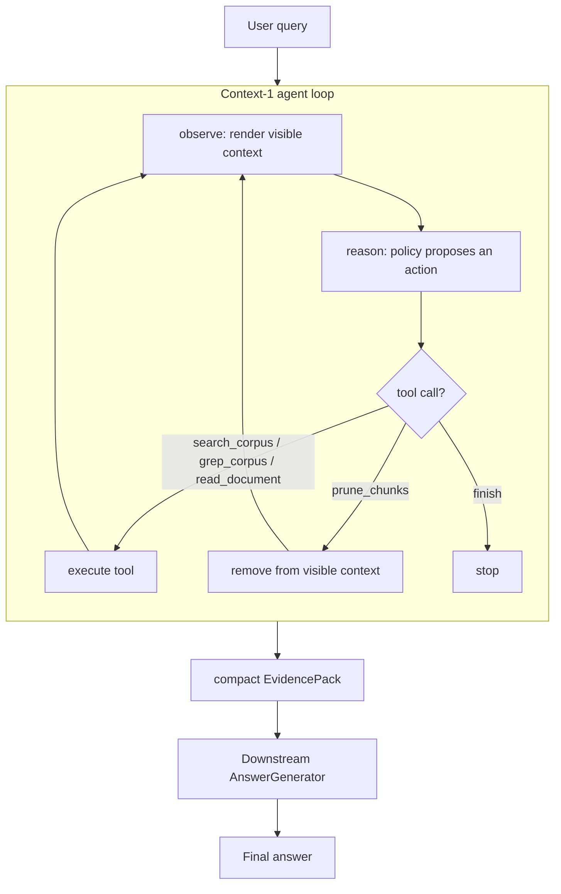

# Context-1

Context-1 is an **agentic retrieval / context-management agent**. It does not answer
the user's question. Given a question, it iteratively searches a local document
corpus, reads documents, greps for exact terms, and prunes irrelevant context from
its own working memory — then hands off a compact, structured `EvidencePack` to a
separate downstream answer model.

## Why one-shot RAG isn't enough

A one-shot RAG pipeline (`query -> top-k -> LLM`) does a single retrieval pass. That
works for single-hop questions but breaks on multi-hop ones, where the second query
depends on something you learn from the first result:

> "Who designed the machine that the first computer programmer wrote notes about,
> and in what city was that person born?"

A single embedding of this question is a poor match for either "Ada Lovelace" or
"Charles Babbage" individually — the question only decomposes into searchable
sub-questions once you already know Ada Lovelace's notes were about Charles
Babbage's Analytical Engine. An agent that can search, read what it found, and issue
a *second*, better-informed search is the only way to close that gap without just
stuffing a huge top-k into the prompt and hoping the answer model does the reasoning
work the retriever was supposed to do.

## Architecture



Two states are kept deliberately separate:

- **Full trajectory** (`context_agent.context.state.TrajectoryState`) — every action,
  observation, retrieved chunk, score, error, and timing, for the whole run.
  Append-only, never pruned. Used for debugging, evaluation, and SFT/GRPO data.
- **Model-visible context** (`context_agent.context.manager.ContextManager`) — the
  small working set of chunks the agent actually sees when it's asked for its next
  action. `prune_chunks` only removes ids from this view; the underlying record in
  `TrajectoryState` is untouched. A token budget auto-evicts the weakest chunks from
  the visible set (never from the full trajectory) if it grows too large.

This split is the whole point of the project: an agent that manages what it looks at,
while still leaving a complete, inspectable record of everything it ever found.

## The four tools

Context-1's policy has exactly four tools — everything else (planning, verifying,
deciding what's still unresolved, deciding when to stop) is the policy's own
reasoning inside its `thought`, not a fifth tool.

| Tool | Purpose |
|---|---|
| `search_corpus(query, top_k)` | BM25 + dense (Qdrant) retrieval fused with Reciprocal Rank Fusion, optional cross-encoder reranking. |
| `grep_corpus(pattern, document_ids?, regex?, max_results)` | Exact phrase/regex search, for when the agent already knows what string it's looking for. |
| `read_document(document_id, start_chunk?, end_chunk?)` | Read a document, or a specific chunk range, in full. |
| `prune_chunks(chunk_ids)` | Remove chunks from the model-visible context (not from the full trajectory). |

All four are structured, Pydantic-validated tool calls. A parser
(`context_agent.agent.actions.parse_action`) tolerates invalid JSON, unknown tool
names, and missing/mistyped arguments — turning any of those into a typed
`ActionParseError` observation instead of crashing the loop.

## Retrieval stack

```
query -> BM25 (rank_bm25) ------\
                                  +--> Reciprocal Rank Fusion --> [reranker?] --> top-k
query -> dense (Qdrant, embedded) /
```

Every stage is toggleable in `configs/retrieval.yaml` (`use_bm25`, `use_dense`,
`use_reranker`) to support ablations: BM25-only, dense-only, hybrid, with/without
reranking. Qdrant runs in embedded/local mode (`qdrant_client.QdrantClient`) — no
server process required.

**Models**: by default the dense embedder is a small, dependency-free hashing
bag-of-words embedder (`dense_model: hashing`) and the reranker is a small
cross-encoder, so the whole repo runs offline on CPU with no downloads. Set
`dense_model: BAAI/bge-m3` and `reranker_model: BAAI/bge-reranker-v2-m3` in
`configs/retrieval.yaml` for the production-like setup the underlying research this
project mirrors actually uses — those are real, wired-up options, just not what the
test suite exercises (they'd download several GB of weights and are slow on CPU).

## Quick start

```bash
cd context1
python3 -m venv .venv && source .venv/bin/activate   # optional
pip install -e ".[dev]"

python scripts/prepare_data.py          # builds a small synthetic multi-hop corpus, offline
python scripts/build_index.py           # builds BM25 + dense indexes, runs a sanity search
python scripts/run_agent.py --query "Who designed the Analytical Engine that Ada Lovelace wrote notes about?" --answer
context-agent ask "Who created Python and where was he born?"
```

`prepare_data.py --hotpotqa -n 40` pulls a small real HotpotQA slice instead (needs
network access to Hugging Face); the synthetic fixture is the default because it's
reproducible and needs nothing.

## Evaluation

```bash
python scripts/run_baselines.py    # quick console comparison table
python scripts/evaluate.py         # full run, saves artifacts/runs/<run_id>/{config,trajectories,metrics}.json
```

Four comparable pipelines, all producing an `EvidencePack` + answer + stats:

- `baseline_direct` — no retrieval.
- `baseline_one_shot_rag` — single retrieval call, small top-k.
- `baseline_long_context_rag` — single retrieval call, large top-k.
- `baseline_agentic` — Context-1: the full harness (search/grep/read/prune, iterative).

Metrics: retrieval (`recall@k`, `precision@k`, supporting-document recall,
supporting-fact recall — the latter approximated at document granularity, see
`evaluation/metrics.py`), agent (steps, tool calls, tool validity rate, duplicate
calls, retrieved/pruned chunks, context tokens, latency, success rate), and answer
(exact match, token F1).

With the default synthetic corpus (7 documents) and the default single-search Mock
policy, `agentic` and `one_shot_rag` retrieve near-identically — the corpus is small
enough that one good search already finds everything. The point of the harness (and
what the dedicated tests in `tests/test_prune_and_dedup.py` and
`tests/test_agent_harness_mock.py` actually exercise) is iterative,
multi-step retrieval with context management; seeing it clearly outperform one-shot
RAG needs either a larger/harder corpus or a real LLM policy making multi-hop
decisions, not the deterministic demo script.

## Training (optional extension)

Inference does not require any of this. It's scaffolded so real trajectories can
become training data later:

```bash
python scripts/evaluate.py                      # produces artifacts/runs/<id>/trajectories.jsonl
python -c "
from context_agent.training.dataset import load_trajectories_jsonl, trajectories_to_sft_dataset, save_sft_jsonl
trajectories = load_trajectories_jsonl('artifacts/runs/<id>/trajectories.jsonl')
save_sft_jsonl(trajectories_to_sft_dataset(trajectories), 'data/trajectories/sft_train.jsonl')
"
python scripts/train_sft.py --config configs/sft.yaml   # QLoRA, requires a CUDA GPU
```

Each trajectory step records its exact `context_snapshot` (the rendered
model-visible context at that point), so `training/dataset.py` reconstructs real
`(prompt, completion)` pairs without replaying retrieval.

`training/rewards.py` implements the reward function used by GRPO:

```
reward = evidence_recall + success_bonus
         - alpha * (tool_calls + duplicate_calls)
         - beta  * context_tokens
         - gamma * invalid_actions
```

Pure and independently unit-tested (`tests/test_rewards.py`); `training/sft.py` is a
QLoRA/PEFT/TRL wrapper for fine-tuning a Qwen policy on the SFT dataset above — it
needs a CUDA GPU and is not exercised by the test suite (import-checked only).

`training/grpo.py` implements the GRPO stage itself: it samples `group_size` full
episodes per question from the *current* policy against the real corpus and tools
(`agent.harness.AgentHarness`, via a local-HF-model `HFAgentPolicy`), scores each
episode with `compute_reward`, and takes a policy-gradient step using the
group-relative advantage `(reward - group_mean) / group_std` plus a KL penalty back to
the frozen base weights (computed via `model.disable_adapter()`, so no second model
copy is needed). Run it after SFT:

```bash
python scripts/train_grpo.py --config configs/grpo.yaml
```

Only the pure `group_advantages` helper is unit-tested
(`tests/test_grpo_advantages.py`); the rollout/training loop needs a CUDA GPU and real
model weights, so it is import-checked only, like `training/sft.py`.

## Agent policy

`AgentPolicy.next_action(query, context_text, available_tools, step) -> str` returns
the raw model completion (not a pre-parsed action) — that's what a real LLM actually
produces, and it's what lets malformed-JSON handling be tested identically for both
implementations:

- `MockAgentPolicy` — deterministic scripted actions. No GPU, no network. Used by
  every test and as the CLI default.
- `LLMAgentPolicy` — talks to any OpenAI-compatible endpoint (e.g. vLLM serving
  `Qwen/Qwen3-8B`). Set `policy: llm` and the `llm:` block in `configs/agent.yaml`.
  Unit-tested against a fake client (`tests/test_llm_policy.py`); actually running it
  needs your own vLLM/OpenAI-compatible server — this repo has no GPU to host one.

## Tests

```bash
pytest
```

64 tests, no GPU or network required: `ContextManager` (dedup, prune, budget,
render, stats), BM25, RRF, hybrid retrieval (hashing embedder + embedded Qdrant),
structured-action parsing (valid, malformed, unknown tool, missing args), the four
tools, the harness (`max_steps`, `max_tool_calls`, duplicate detection, fallback
finish, tool exceptions), `EvidencePack`, metrics, rewards, baselines/evaluator, the
LLM policy against a fake client, and one end-to-end integration test.

## Project layout

```
context1/
├── configs/            default.yaml, agent.yaml, retrieval.yaml, evaluation.yaml
├── src/context_agent/
│   ├── agent/          actions (structured tool calls), policy, harness (the loop), prompts
│   ├── context/         state (full trajectory), manager (visible context)
│   ├── retrieval/       bm25, dense, qdrant_store, fusion (RRF), reranker, hybrid, indexing
│   ├── tools/            search_corpus, grep_corpus, read_document, prune_chunks
│   ├── evidence/         EvidenceItem / EvidencePack
│   ├── answering/        AnswerGenerator (decoupled from the agent)
│   ├── evaluation/       metrics, evaluator, baselines
│   ├── training/         trajectory -> SFT dataset, rewards, QLoRA sft.py
│   ├── data/              corpus/chunking, HotpotQA-subset + synthetic benchmark
│   └── cli.py            `context-agent ask "..."`
├── scripts/              prepare_data.py, build_index.py, run_agent.py, run_baselines.py, evaluate.py
└── tests/
```

## Current limitations

This is a pet-project MVP, not a production system:

- Default retrieval models are lightweight/offline stand-ins (hashing embedder, a
  small cross-encoder); the "real" `BAAI/bge-m3` / `BAAI/bge-reranker-v2-m3` config
  is wired up but not exercised in this environment (no GPU, and downloading multi-GB
  weights isn't done automatically).
- `LLMAgentPolicy` needs an external OpenAI-compatible endpoint (vLLM serving
  `Qwen3-8B` or similar); nothing in this repo hosts one.
- Supporting-fact recall is approximated at document granularity (a fact "counts" if
  its source document made it into the evidence pack), not exact sentence-level
  matching — chunking is coarse enough that this is usually equivalent for the small
  demo corpus, but it's an approximation, not ground truth.
- Qdrant runs embedded (`qdrant_client.QdrantClient`, no server process), which is
  genuinely Qdrant's client/storage engine but not a networked deployment.
- `training/sft.py` (QLoRA) and `training/grpo.py` (GRPO) are implemented but not run
  here — no GPU available in this environment.
- The benchmark is a tiny (7-document/3-question) synthetic fixture by default;
  `--hotpotqa` pulls a slightly larger real slice but is still meant for local
  experimentation, not a leaderboard-scale evaluation.
